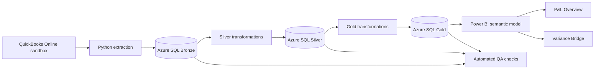

# CloudFlow FP&A Dashboard

CloudFlow FP&A Dashboard is a Power BI Project (`.pbip`) for monthly financial planning and analysis. It combines general-ledger actuals with budget and forecast data to provide a management P&L and an account-level variance bridge.

CloudFlow Systems, Inc. is a fictional B2B SaaS company created for this portfolio project. The solution uses synthetic business data and a QuickBooks Online sandbox; it contains no real company or customer data. The accounting history covers September 2023 through August 2026.

## End-to-end architecture

This report is the presentation layer of the companion `quickbooks-pipeline` project. That project extracts accounting data from QuickBooks Online, stores raw API responses, transforms them into analytical tables, and publishes curated datasets to Azure SQL for Power BI.



The upstream layers serve different purposes:

- **Bronze** preserves raw QuickBooks API payloads with batch and extraction metadata.
- **Silver** parses the source data, standardizes types, creates signed debit and credit amounts, and provides conformed account and customer dimensions.
- **Gold** publishes reporting-ready monthly Actual, Budget, and Forecast datasets with normalized P&L signs.
- **Power BI** adds the financial measures, comparison logic, presentation formatting, and interactive analysis documented below.

## Dashboard pages

### P&L Overview

The P&L Overview is the main management reporting page. It includes:

- A reporting month selector.
- Monthly and year-to-date reporting views.
- YoY, MoM, Budget, and Forecast comparisons.
- KPI cards for Revenue, Gross Margin, Operating Profit, and Net Profit.
- A detailed income statement with Actual, Comparison, Variance, and Variance % columns.
- Favorability formatting with arrows and colors. Green indicates a favorable result and red indicates an unfavorable result. Higher costs and expenses are treated as unfavorable, while higher revenue and profit are favorable.
- Information icons that open definitions and formulas for each P&L line.

The income statement contains these lines:

| P&L line | Definition |
| --- | --- |
| Revenue | Income from core operations before costs and expenses. |
| Cost of Goods Sold | Direct costs required to deliver the products and services sold. |
| Gross Profit | Revenue − Cost of Goods Sold. |
| Gross Margin (%) | Gross Profit ÷ Revenue. Variances are shown in percentage points. |
| Operating Expenses | Indirect costs of running the business. |
| Operating Profit | Gross Profit − Operating Expenses. |
| Other Income | Income outside core operations. |
| Other Expenses | Expenses outside core operations. |
| Net Profit | Operating Profit + Other Income − Other Expenses. |
| Depreciation add-back | Depreciation added back as a non-cash charge. |
| Less: Interest Income | Interest income removed because EBITDA excludes financing-related income. |
| EBITDA | Net Profit + Depreciation add-back − Interest Income. Operating taxes and license fees remain in operating expenses. |

### Variance Bridge

The Variance Bridge explains changes in Revenue or COGS by account. Users can select:

- **Reporting Month** — the month being analyzed.
- **Analyze** — Revenue or COGS.
- **Compare** — YoY, MoM, vs Budget, or vs Forecast.

The waterfall begins with the selected comparison value, shows each account's contribution, and ends with the selected month's actual value. The table below the chart provides the comparison value, actual value, absolute variance, and variance percentage for each account.

The chart uses a focused Y-axis range so relatively small movements remain visible beside large endpoint totals. For COGS, decreases are favorable and increases are unfavorable.

### P&L Line Help

This hidden tooltip page supplies the definitions displayed from the information icons on the P&L table. It is not intended for direct navigation.

## Comparison behavior

| Comparison | Benchmark |
| --- | --- |
| YoY | Same month or YTD period in the prior year. |
| MoM | Previous month. MoM is available for the monthly view. |
| vs Budget | Budget for the selected month or YTD period. |
| vs Forecast | Latest available forecast version for the selected month or YTD period. |

The report warns users when the selected period lacks sufficient history. It also flags forecast periods whose latest forecast version is marked as `Actualized`, because Actual vs Forecast is expected to be zero for those periods.

## Semantic model

The model uses imported data from the `cloudflow_fpa` Azure SQL database on `cloudflow-fpa-sql-kr.database.windows.net`.

Core tables include:

- `silver fact_gl` — general-ledger transactions and the main P&L and variance measures.
- `silver dim_account` — account names, types, and subtypes used to construct the P&L and bridge.
- `silver dim_customer` — customer dimension.
- `gold pnl_monthly_actual` — monthly actual P&L data.
- `gold fpa_monthly` — monthly Budget and Forecast values.
- `gold fpa_version` — forecast version metadata, including forecast-as-of dates.
- `gold fpa_month` — planning calendar attributes.

The source pipeline also maintains `silver.fact_plan`, which stores Budget and Forecast detail at version, month, account, and department grain. The `gold.fpa_monthly` view aggregates that planning data to the grain used by this dashboard and combines it with live Actuals without joining fact rows to one another.

### Amount and sign conventions

The planning model provides two amount concepts. This dashboard uses `reporting_amount_usd` for comparisons because it follows one additive reporting convention: revenue is positive, while expenses and contra revenue are negative. The source-oriented `amount_usd` preserves presentation from the originating files and should not be substituted in variance calculations.

The DAX measures convert these source signs into the display conventions used on each page. For example, COGS is displayed as a positive cost in the P&L, while the favorability measures still treat a cost decrease as favorable.

### Budget and forecast versions

- Budget and Forecast data are loaded as complete versioned snapshots rather than incremental patches.
- Forecast versions have an explicit `forecast_as_of` date and distinguish `Actualized` months from future `Forecast` months.
- The supplied latest forecast is based on an April 30, 2026 cutoff: September 2023 through April 2026 is Actualized, and May through August 2026 is Forecast.
- The report selects the latest available forecast version for `vs Forecast` comparisons.
- Snapshot history remains available even if accounting Actuals are later restated.

The dashboard intentionally warns when a selected forecast month is Actualized. Actual vs Forecast is expected to be zero in that case because the snapshot already contains actual results for that month.

Disconnected helper tables drive report selections and display order, including `Reporting Month`, `Reporting View`, `Bridge Comparison`, `Bridge Metric`, `Bridge Month`, and `P&L Lines`.

## Project structure

```text
CloudFlow FP&A Dashboard.pbip
CloudFlow FP&A Dashboard.Report/
  definition/                 # PBIR pages, visuals, bookmarks, and report settings
CloudFlow FP&A Dashboard.SemanticModel/
  definition/                 # TMDL tables, measures, relationships, and expressions
```

The source-controlled PBIP format keeps report and semantic-model definitions as text files. Visual definitions are stored as PBIR JSON, while model objects and DAX measures are stored as TMDL.

## Opening and refreshing

1. Open `CloudFlow FP&A Dashboard.pbip` in Power BI Desktop.
2. Sign in or provide credentials for the Azure SQL source when prompted.
3. Refresh the semantic model to load current Actual, Budget, and Forecast data.
4. Save the project after Power BI applies any external definition changes.

Access to the Azure SQL server and database is required for refresh. The report can still open with its locally cached data when the source is temporarily unavailable.

For a complete source-to-report refresh, use this sequence in the companion pipeline project:

1. Run the QuickBooks extraction into Bronze.
2. Transform Bronze data into the Silver accounting model.
3. Build the Gold monthly Actual datasets.
4. Run and persist the pipeline QA checks.
5. Import a new or corrected Budget/Forecast snapshot when one has been published.
6. Refresh this Power BI project.

The pipeline's full refresh notebook does not automatically reload planning CSVs. Budget and Forecast imports are a separate controlled step so published versions are changed only when intended.

## Upstream data quality

The pipeline writes check results to `qa.pipeline_checks`. Its current controls include:

- Bronze datasets are not empty.
- Required Silver fields are populated.
- Journal line IDs are unique.
- Journal entries balance.
- The expected reporting-month coverage is present.
- Gold outputs are not empty.
- Planning rows have valid account mappings, signs, cents, grain, forecast basis, and as-of dates.

Critical failures can stop the pipeline before downstream data reaches Power BI. These controls reduce ingestion risk, but report QA should still reconcile headline totals and representative accounts after every refresh.

## Validation notes

- Select a single reporting month for consistent KPI, P&L, and bridge results.
- Confirm that the account dimension classifies accounts into the expected `account_type` and `account_subtype` values; these mappings drive every P&L line.
- Forecast comparisons use the latest available `forecast_as_of` version.
- EBITDA reflects the account mappings currently available in the model. The implementation adds back depreciation and removes interest income; operating taxes and license fees remain included in operating expenses.
- Planning data contains department and primary-driver attributes, but the current Actuals Gold table does not have department grain. This dashboard therefore compares plans with Actuals at the aggregated account/month level and does not invent department allocations.
- The monthly model is designed for monthly and YTD analysis. Daily time intelligence would require a daily calendar and corresponding source grain.

## Related project

The extraction, transformation, QA, planning-import, and local setup instructions are documented in the companion [QuickBooks pipeline README](../quickbooks-pipeline/README.md).
